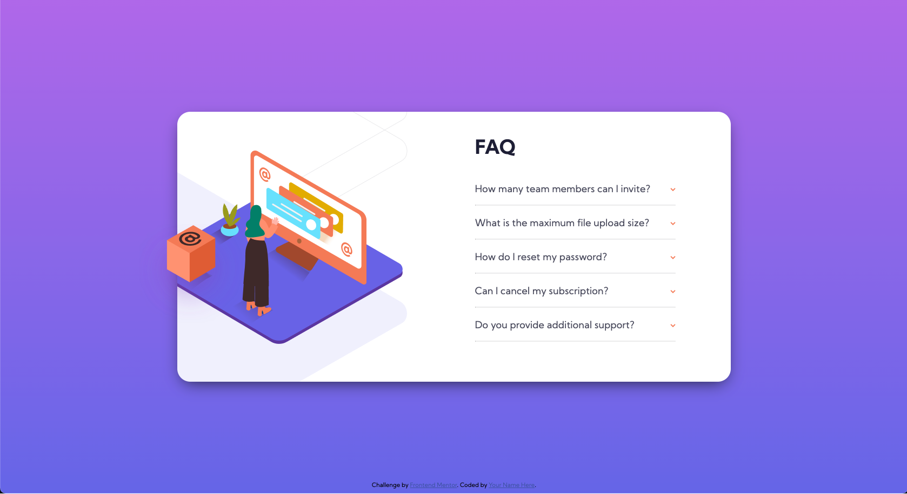

# Frontend Mentor - FAQ accordion card solution

This is a solution to the [FAQ accordion card challenge on Frontend Mentor](https://www.frontendmentor.io/challenges/faq-accordion-card-XlyjD0Oam). 

## Table of contents

- [Overview](#overview)
  - [Screenshot](#screenshot)
  - [Links](#links)
- [My process](#my-process)
  - [Built with](#built-with)
  - [What I learned](#what-i-learned)  
- [Author](#author)

## Overview

At the moment I've made desktop version with only HTML(hopefully somehow semantic) and CSS. I can already see my weaknesses when trying to work on multiple elements and their positioning. The next step is to try and make mobile version. Hide and show will be dropped at the moment.

### Screenshot

### Links

- Live Site URL: [Accordion FAQ Solution](https://adamskys.github.io/FAQcard-FEMentor/)

## My process

### Built with

- Semantic HTML5 markup
- CSS custom properties
- Flexbox

### What I learned

Capability to turn given graphic design into CSS and HTML. 

## Author

Mario Krok-Adamski

